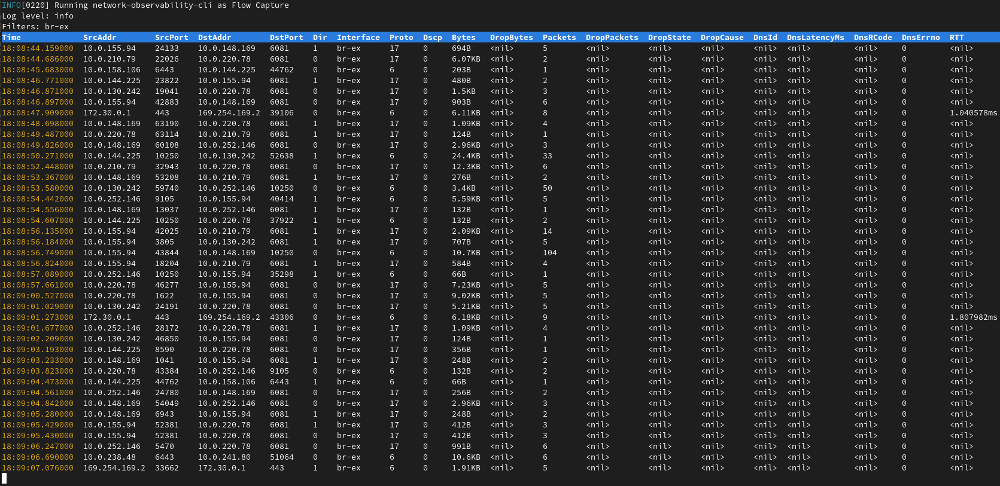

# Network Observability CLI

network-observability-cli is a lightweight Flow and Packet visualisation tool.
It deploys [netobserv eBPF agent](https://github.com/netobserv/netobserv-ebpf-agent) on your k8s cluster to collect flows or packets from nodes network interfaces
and streams data to a local collector for analysis and visualisation.
Output files are generated under `output/flow` and `output/pcap` directories per host name

## Work In Progress

This project is still a WIP. The following list gives an overview of the current progression:

- [x] Capture flows
- [x] Capture packets
- [x] Basic filter capabilities
- [ ] Advanced filter capabilities
- [ ] Testing
- [ ] Linting
- [ ] Dockerfile
- [ ] Allow switching between `kubectl` / `oc` commands

Feel free to contribute !

## Prerequisites

To run this CLI, you will need:
- A running kubernetes / OpenShift cluster
- `oc` command installed and connected
- Admin rights

## Build

To build the project locally:
```
make build
```

This will also copy resources and oc commands to the `build` directoy.

## Run

### Flow Capture

Simply run the following command to start capturing flows:

```
./bin/oc-netobserv-flows
```



It will display a table view with latest flows collected and write data under output/flow directory.
To stop capturing press Ctrl-C.

### Packet Capture

PCAP generated files are compatible with Wireshark

```
./bin/oc-netobserv-packets
```


It will display a table view with latest packets collected and write data under output/pcap directory.
To stop capturing press Ctrl-C.

### Cleanup

The `cleanup` function will automatically remove the eBPF programs when the CLI exits. However you may need to run it manually if an error occurs.

```
./bin/oc-netobserv-cleanup
```

## Extending OpenShift CLI with plugin

You can add this plugin to your favorite oc commands using the following steps:
```
make build
sudo cp -a ./build/. /usr/bin/
```

This will add `oc netobserv flows` and `oc netobserv packets` commands to your cli.
You can verify the commands are available using:
```
oc plugin list
```

It will display as result:
```
The following compatible plugins are available:
...
/usr/bin/oc-netobserv-cleanup
/usr/bin/oc-netobserv-flows
/usr/bin/oc-netobserv-packets
```

More info [on official Openshift documentation](https://docs.openshift.com/container-platform/4.14/cli_reference/openshift_cli/extending-cli-plugins.html).
